# ConstraintLayoutDemo

> Android ConstraintLayout Demo
> 
> 参考文章：https://www.jianshu.com/p/a74557359882

## base

---

### 填充满父布局

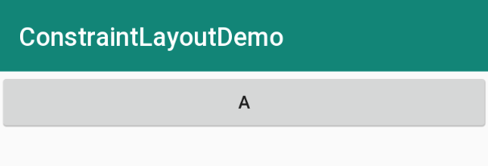

```
<?xml version="1.0" encoding="utf-8"?>
<android.support.constraint.ConstraintLayout xmlns:android="http://schemas.android.com/apk/res/android"
    xmlns:app="http://schemas.android.com/apk/res-auto"
    android:layout_width="match_parent"
    android:layout_height="match_parent">

    <!--宽填充满父布局-->
    <Button
        android:id="@+id/bt_1"
        android:layout_width="0dp"
        android:layout_height="wrap_content"
        android:text="A"
        app:layout_constraintEnd_toEndOf="parent"
        app:layout_constraintStart_toStartOf="parent" />
    
</android.support.constraint.ConstraintLayout>
```

### constraintHorizontal_bias

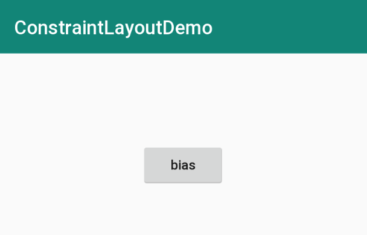

```
<?xml version="1.0" encoding="utf-8"?>
<android.support.constraint.ConstraintLayout xmlns:android="http://schemas.android.com/apk/res/android"
    xmlns:app="http://schemas.android.com/apk/res-auto"
    android:layout_width="match_parent"
    android:layout_height="match_parent">

    <!--
    bias：偏移量
    layout_constraintHorizontal_bias:   垂直偏移比例
    layout_constraintVertical_bias:     水平偏移比例
    -->
    <Button
        android:id="@+id/imageView2"
        android:layout_width="wrap_content"
        android:layout_height="wrap_content"
        android:text="bias"
        android:textAllCaps="false"
        app:layout_constraintBottom_toBottomOf="parent"
        app:layout_constraintEnd_toEndOf="parent"
        app:layout_constraintStart_toStartOf="parent"
        app:layout_constraintTop_toTopOf="parent"
        app:layout_constraintHorizontal_bias="0.5"
        app:layout_constraintVertical_bias="0.2" />

</android.support.constraint.ConstraintLayout>
```

### 居中

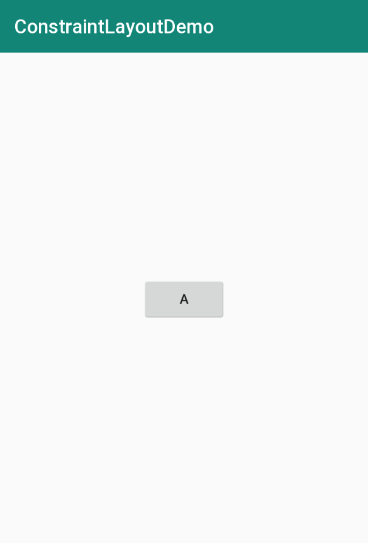

```
<?xml version="1.0" encoding="utf-8"?>
<android.support.constraint.ConstraintLayout xmlns:android="http://schemas.android.com/apk/res/android"
    xmlns:app="http://schemas.android.com/apk/res-auto"
    android:layout_width="match_parent"
    android:layout_height="match_parent">

    <!--居中-->
    <Button
        android:id="@+id/bt_1"
        android:layout_width="wrap_content"
        android:layout_height="wrap_content"
        android:text="A"
        app:layout_constraintBottom_toBottomOf="parent"
        app:layout_constraintEnd_toEndOf="parent"
        app:layout_constraintStart_toStartOf="parent"
        app:layout_constraintTop_toTopOf="parent" />

</android.support.constraint.ConstraintLayout>
```

### constraintHorizontal_chainStyle

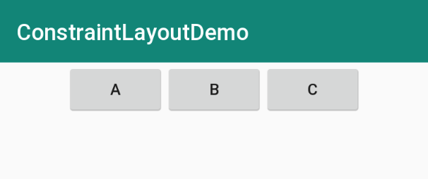

```
<?xml version="1.0" encoding="utf-8"?>
<android.support.constraint.ConstraintLayout xmlns:android="http://schemas.android.com/apk/res/android"
    xmlns:app="http://schemas.android.com/apk/res-auto"
    android:layout_width="match_parent"
    android:layout_height="match_parent">

    <!--
    layout_constraintHorizontal_chainStyle:
    spread:         间隔相等
    spread_inside:  间隔相等，但只存在中间
    packed:         打包
    -->
    <Button
        android:id="@+id/bt_1"
        android:layout_width="wrap_content"
        android:layout_height="wrap_content"
        android:text="A"
        app:layout_constraintEnd_toStartOf="@id/bt_2"
        app:layout_constraintHorizontal_chainStyle="packed"
        app:layout_constraintStart_toStartOf="parent"
        app:layout_constraintTop_toTopOf="parent" />

    <Button
        android:id="@+id/bt_2"
        android:layout_width="wrap_content"
        android:layout_height="wrap_content"
        android:text="B"
        app:layout_constraintEnd_toStartOf="@id/bt_3"
        app:layout_constraintStart_toEndOf="@id/bt_1" />

    <Button
        android:id="@+id/bt_3"
        android:layout_width="wrap_content"
        android:layout_height="wrap_content"
        android:text="C"
        app:layout_constraintEnd_toEndOf="parent"
        app:layout_constraintStart_toEndOf="@id/bt_2" />

</android.support.constraint.ConstraintLayout>
```

### constraintCircle

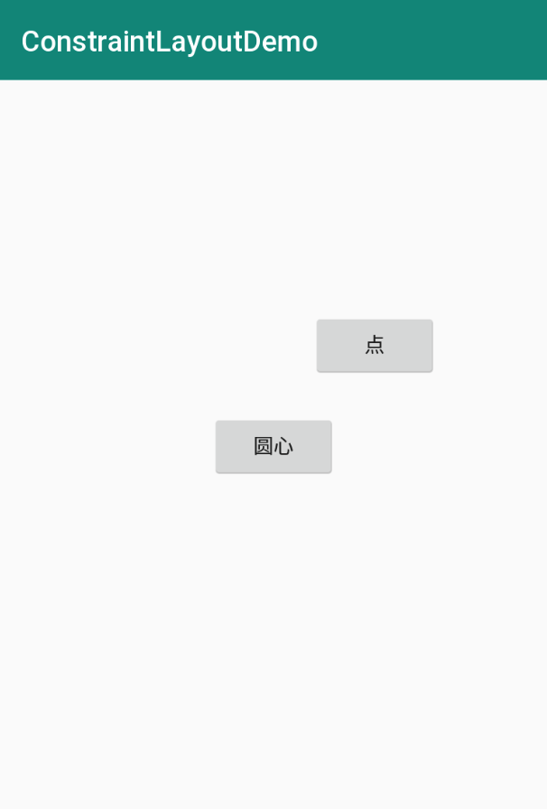

```
<?xml version="1.0" encoding="utf-8"?>
<android.support.constraint.ConstraintLayout xmlns:android="http://schemas.android.com/apk/res/android"
    xmlns:app="http://schemas.android.com/apk/res-auto"
    android:layout_width="match_parent"
    android:layout_height="match_parent">

    <Button
        android:id="@+id/bt_1"
        android:layout_width="wrap_content"
        android:layout_height="wrap_content"
        android:text="圆心"
        app:layout_constraintBottom_toBottomOf="parent"
        app:layout_constraintEnd_toEndOf="parent"
        app:layout_constraintStart_toStartOf="parent"
        app:layout_constraintTop_toTopOf="parent" />

    <!--
    圆形定位:

    //引用的控件ID
    app:layout_constraintCircle="@+id/btn_2"
    //圆半径
    app:layout_constraintCircleRadius="100dp"
    //偏移圆角度  水平右方向为0逆时针方向旋转
    app:layout_constraintCircleAngle="45"
    -->
    <Button
        android:id="@+id/btn_2"
        android:layout_width="wrap_content"
        android:layout_height="wrap_content"
        android:text="点"
        android:textAllCaps="false"
        app:layout_constraintCircle="@id/bt_1"
        app:layout_constraintCircleAngle="45"
        app:layout_constraintCircleRadius="100dp" />

</android.support.constraint.ConstraintLayout>
```

### constraintDimensionRatio

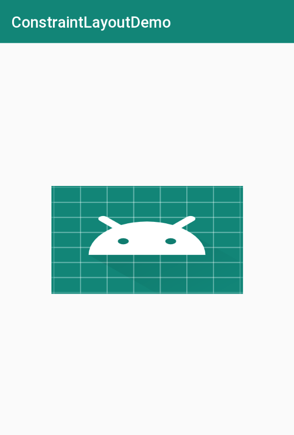

```
<?xml version="1.0" encoding="utf-8"?>
<android.support.constraint.ConstraintLayout xmlns:android="http://schemas.android.com/apk/res/android"
    xmlns:app="http://schemas.android.com/apk/res-auto"
    android:layout_width="match_parent"
    android:layout_height="match_parent">

    <!--
    尺寸比例
    layout_constraintDimensionRatio="H,16:9":   W:H是16：9，H动态适配
    layout_constraintDimensionRatio="W,16:9":   W:H是16：9，W动态适配
    -->
    <ImageView
        android:id="@+id/imageView2"
        android:layout_width="0dp"
        android:layout_height="140dp"
        android:scaleType="fitXY"
        android:src="@mipmap/ic_launcher"
        app:layout_constraintStart_toStartOf="parent"
        app:layout_constraintEnd_toEndOf="parent"
        app:layout_constraintTop_toTopOf="parent"
        app:layout_constraintBottom_toBottomOf="parent"
        app:layout_constraintDimensionRatio="W,16:9" />

</android.support.constraint.ConstraintLayout>
```

### goneMargin

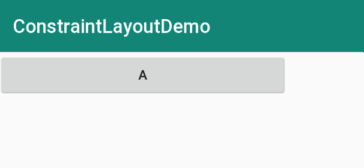

```
<?xml version="1.0" encoding="utf-8"?>
<android.support.constraint.ConstraintLayout xmlns:android="http://schemas.android.com/apk/res/android"
    xmlns:app="http://schemas.android.com/apk/res-auto"
    android:layout_width="match_parent"
    android:layout_height="match_parent">

    <!--
    goneMargin: 依赖的View设置Gone以后才会生效的属性

    当 bt_2 设置 android:visibility="gone" 后，
    bt_1 的 app:layout_goneMarginEnd="80dp" 就会生效。
    -->
    <Button
        android:id="@+id/bt_1"
        android:layout_width="0dp"
        android:layout_height="wrap_content"
        android:text="A"
        app:layout_constraintLeft_toLeftOf="parent"
        app:layout_constraintRight_toLeftOf="@+id/bt_2"
        app:layout_goneMarginEnd="80dp" />

    <Button
        android:id="@+id/bt_2"
        android:layout_width="0dp"
        android:layout_height="wrap_content"
        android:text="B"
        android:visibility="gone"
        app:layout_constraintLeft_toRightOf="@+id/bt_1"
        app:layout_constraintRight_toRightOf="parent" />

</android.support.constraint.ConstraintLayout>
```

### constraintHorizontal_weight

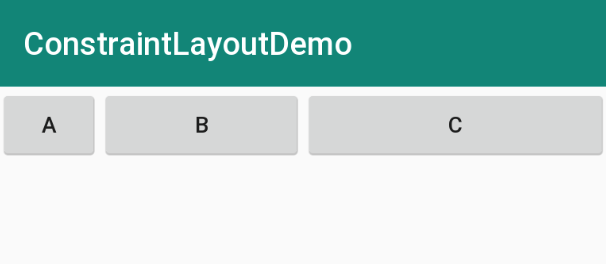

```
<?xml version="1.0" encoding="utf-8"?>
<android.support.constraint.ConstraintLayout xmlns:android="http://schemas.android.com/apk/res/android"
    xmlns:app="http://schemas.android.com/apk/res-auto"
    android:layout_width="match_parent"
    android:layout_height="match_parent">

    <!--
    权重：
    layout_constraintHorizontal_weight: 水平权重
    layout_constraintVertical_weight:   垂直权重
    -->
    <Button
        android:id="@+id/bt_1"
        android:layout_width="0dp"
        android:layout_height="wrap_content"
        android:text="A"
        app:layout_constraintEnd_toStartOf="@+id/bt_2"
        app:layout_constraintHorizontal_weight="1"
        app:layout_constraintStart_toStartOf="parent" />

    <Button
        android:id="@+id/bt_2"
        android:layout_width="0dp"
        android:layout_height="wrap_content"
        android:text="B"
        app:layout_constraintEnd_toStartOf="@+id/bt_3"
        app:layout_constraintHorizontal_weight="2"
        app:layout_constraintStart_toEndOf="@+id/bt_1" />

    <Button
        android:id="@+id/bt_3"
        android:layout_width="0dp"
        android:layout_height="wrap_content"
        android:text="C"
        app:layout_constraintEnd_toEndOf="parent"
        app:layout_constraintHorizontal_weight="3"
        app:layout_constraintStart_toEndOf="@+id/bt_2" />

</android.support.constraint.ConstraintLayout>
```

### constrainedWidth

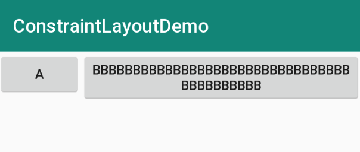

```
<?xml version="1.0" encoding="utf-8"?>
<android.support.constraint.ConstraintLayout xmlns:android="http://schemas.android.com/apk/res/android"
    xmlns:app="http://schemas.android.com/apk/res-auto"
    android:layout_width="match_parent"
    android:layout_height="match_parent">

    <Button
        android:id="@+id/bt_1"
        android:layout_width="wrap_content"
        android:layout_height="wrap_content"
        android:text="A"
        app:layout_constraintStart_toStartOf="parent" />

    <!--
    layout_constrainedWidth: 强制约束宽高

    控件的宽设置为 WRAP_CONTENT 时，
    如果实际宽度超过了约束的最大宽度，那么约束会失效（高同理），
    为了防止约束失效，增加了以下属性：
    app:layout_constrainedWidth="true"     //默认false
    app:layout_constrainedHeight="true"    //默认false
    -->
    <Button
        android:id="@+id/bt_2"
        android:layout_width="wrap_content"
        android:layout_height="wrap_content"
        android:text="BBBBBBBBBBBBBBBBBBBBBBBBBBBBBBBBBBBBBBBBBB"
        app:layout_constrainedWidth="true"
        app:layout_constraintEnd_toEndOf="parent"
        app:layout_constraintStart_toEndOf="@id/bt_1" />

</android.support.constraint.ConstraintLayout>
```

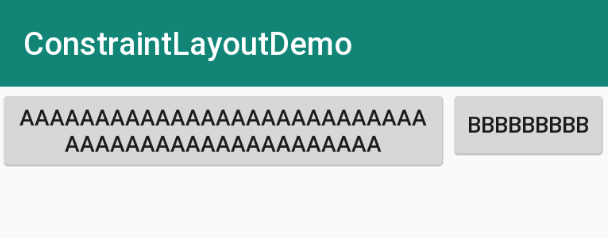

```
<?xml version="1.0" encoding="utf-8"?>
<android.support.constraint.ConstraintLayout xmlns:android="http://schemas.android.com/apk/res/android"
    xmlns:app="http://schemas.android.com/apk/res-auto"
    android:layout_width="match_parent"
    android:layout_height="match_parent">

    <!--
    需求:
    A，B 两控件，B 在 A 的右侧，随着 A，B 宽度的增加，B 始终在 A 的右侧，
    当 A ，B 控件的宽度之和大于父控件的宽度时，B 要求被完全显示，同时 A 被挤压。

    app:layout_constrainedWidth="true"                  强制限制宽度
    app:layout_constraintHorizontal_bias="0"            水平偏移量为0
    app:layout_constraintHorizontal_chainStyle="packed" 链式样式为 packed
    -->
    <Button
        android:id="@+id/bt_1"
        android:layout_width="wrap_content"
        android:layout_height="wrap_content"
        android:text="AAAAAAAAAAAAAAAAAAAAAAAAAAAAAAAAAAAAAAAAAAAAAAAA"
        app:layout_constrainedWidth="true"
        app:layout_constraintHorizontal_bias="0"
        app:layout_constraintHorizontal_chainStyle="packed"
        app:layout_constraintLeft_toLeftOf="parent"
        app:layout_constraintRight_toLeftOf="@id/bt_2"
        app:layout_constraintTop_toTopOf="parent" />

    <Button
        android:id="@+id/bt_2"
        android:layout_width="wrap_content"
        android:layout_height="wrap_content"
        android:text="BBBBBBBBB"
        app:layout_constrainedWidth="true"
        app:layout_constraintLeft_toRightOf="@id/bt_1"
        app:layout_constraintRight_toRightOf="parent"
        app:layout_constraintTop_toTopOf="parent" />

</android.support.constraint.ConstraintLayout>
```

### constraintWidth_max

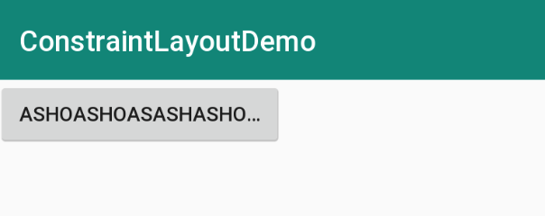

```
<?xml version="1.0" encoding="utf-8"?>
<android.support.constraint.ConstraintLayout xmlns:android="http://schemas.android.com/apk/res/android"
    xmlns:app="http://schemas.android.com/apk/res-auto"
    android:layout_width="match_parent"
    android:layout_height="match_parent">

    <!--
    设置控件的 "最大宽度/最小宽度/最大高度/最小高度"

    layout_constraintWidth_max      最大宽度
    layout_constraintWidth_min      最小宽度
    layout_constraintHeight_max     最大高度
    layout_constraintHeight_min     最下高度
    -->
    <Button
        android:id="@+id/bt_1"
        android:layout_width="0dp"
        android:layout_height="wrap_content"
        android:ellipsize="end"
        android:lines="1"
        android:text="ashoashoasashashoahsohsahshaoshoahsoshaoshoahsoahsohao"
        app:layout_constraintStart_toStartOf="parent"
        app:layout_constraintWidth_max="200dp" />

</android.support.constraint.ConstraintLayout>
```

### constraintWidth_percent

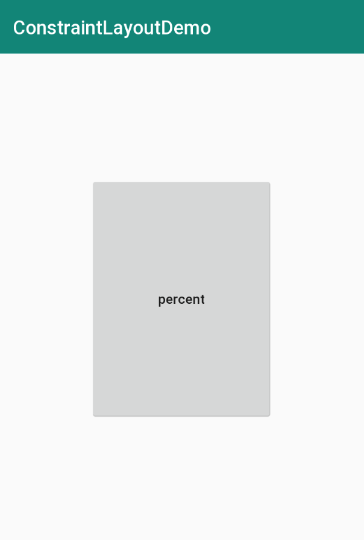

```
<?xml version="1.0" encoding="utf-8"?>
<android.support.constraint.ConstraintLayout xmlns:android="http://schemas.android.com/apk/res/android"
    xmlns:app="http://schemas.android.com/apk/res-auto"
    android:layout_width="match_parent"
    android:layout_height="match_parent">

    <!--
    percent：百分比

    layout_constraintWidth_percent="0.6":   宽度百分比
    layout_constraintHeight_percent="0.25": 高度百分比

    开发中有这样一个需求，控件的宽高为父控件的一半，
    那么我们可以这么去实现：
    1. 首先设置布局的宽高为 0dp
    2. app:layout_constraintWidth_percent="0.5"
       app:layout_constraintHeight_percent="0.5"
    -->
    <Button
        android:id="@+id/imageView2"
        android:layout_width="0dp"
        android:layout_height="0dp"
        android:text="percent"
        android:textAllCaps="false"
        app:layout_constraintBottom_toBottomOf="parent"
        app:layout_constraintEnd_toEndOf="parent"
        app:layout_constraintStart_toStartOf="parent"
        app:layout_constraintTop_toTopOf="parent"
        app:layout_constraintWidth_percent="0.5"
        app:layout_constraintHeight_percent="0.5"/>

</android.support.constraint.ConstraintLayout>
```

## Barrier

---

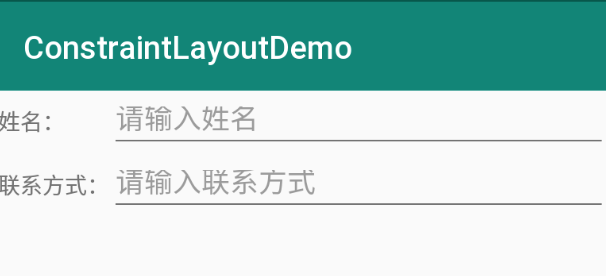

```
<?xml version="1.0" encoding="utf-8"?>
<android.support.constraint.ConstraintLayout xmlns:android="http://schemas.android.com/apk/res/android"
    xmlns:app="http://schemas.android.com/apk/res-auto"
    android:layout_width="match_parent"
    android:layout_height="match_parent">

    <TextView
        android:id="@+id/tv_name"
        android:layout_width="wrap_content"
        android:layout_height="40dp"
        android:gravity="center_vertical"
        android:text="姓名："
        app:layout_constraintStart_toStartOf="parent" />

    <TextView
        android:id="@+id/tv_contract"
        android:layout_width="wrap_content"
        android:layout_height="40dp"
        android:gravity="center_vertical"
        android:text="联系方式："
        app:layout_constraintStart_toStartOf="parent"
        app:layout_constraintTop_toBottomOf="@id/tv_name" />

    <!--
    Barrier 障碍物:
    -->
    <android.support.constraint.Barrier
        android:id="@+id/barrier"
        android:layout_width="wrap_content"
        android:layout_height="wrap_content"
        app:barrierDirection="end"
        app:constraint_referenced_ids="tv_name,tv_contract" />

    <EditText
        android:id="@+id/et_name"
        android:layout_width="0dp"
        android:layout_height="40dp"
        android:hint="请输入姓名"
        app:layout_constraintEnd_toEndOf="parent"
        app:layout_constraintStart_toStartOf="@id/barrier"
        app:layout_constraintTop_toTopOf="parent" />

    <EditText
        android:id="@+id/et_contract"
        android:layout_width="0dp"
        android:layout_height="40dp"
        android:hint="请输入联系方式"
        app:layout_constraintEnd_toEndOf="parent"
        app:layout_constraintStart_toStartOf="@id/barrier"
        app:layout_constraintTop_toBottomOf="@id/et_name" />

</android.support.constraint.ConstraintLayout>
```

## Group

---

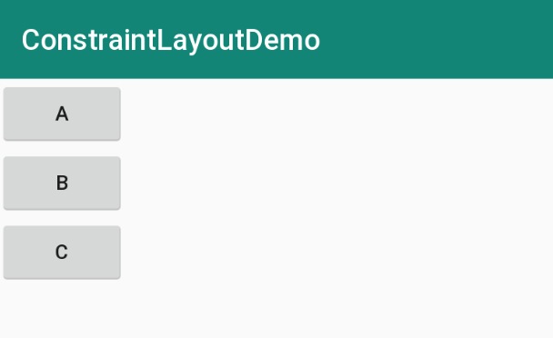

```
<?xml version="1.0" encoding="utf-8"?>
<android.support.constraint.ConstraintLayout xmlns:android="http://schemas.android.com/apk/res/android"
    xmlns:app="http://schemas.android.com/apk/res-auto"
    android:layout_width="match_parent"
    android:layout_height="match_parent">

    <!--
    Group用于控制多个控件的可见性:

    若 Group 设置 android:visibility="gone"，
    那么 button，button2，button3 控件都会隐藏
    -->
    <android.support.constraint.Group
        android:id="@+id/group"
        android:layout_width="wrap_content"
        android:layout_height="wrap_content"
        android:visibility="visible"
        app:constraint_referenced_ids="button,button2,button3" />

    <Button
        android:id="@+id/button"
        android:layout_width="wrap_content"
        android:layout_height="wrap_content"
        android:text="A" />

    <Button
        android:id="@+id/button2"
        android:layout_width="wrap_content"
        android:layout_height="wrap_content"
        android:text="B"
        app:layout_constraintTop_toBottomOf="@id/button" />

    <Button
        android:id="@+id/button3"
        android:layout_width="wrap_content"
        android:layout_height="wrap_content"
        android:text="C"
        app:layout_constraintTop_toBottomOf="@id/button2" />

</android.support.constraint.ConstraintLayout>
```

## Guideline

---

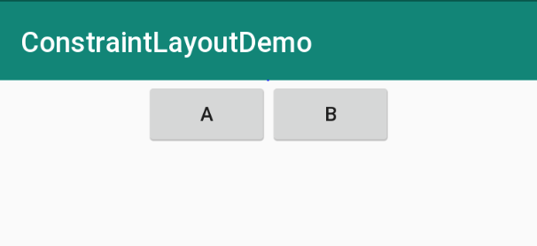

```
<?xml version="1.0" encoding="utf-8"?>
<android.support.constraint.ConstraintLayout xmlns:android="http://schemas.android.com/apk/res/android"
    xmlns:app="http://schemas.android.com/apk/res-auto"
    android:layout_width="match_parent"
    android:layout_height="match_parent">

    <Button
        android:id="@+id/bt_1"
        android:layout_width="wrap_content"
        android:layout_height="wrap_content"
        android:text="A"
        app:layout_constraintEnd_toStartOf="@id/guideline" />

    <!--
    指导线：guideline

    android:orientation="vertical"              设置guideline的方向
    app:layout_constraintGuide_percent="0.5"    guideline位置百分比
    app:layout_constraintGuide_begin="100dp"    guideline距离起点距离
    app:layout_constraintGuide_end="100dp"      guideline距离结点距离
    -->
    <android.support.constraint.Guideline
        android:id="@+id/guideline"
        android:layout_width="wrap_content"
        android:layout_height="wrap_content"
        android:orientation="vertical"
        app:layout_constraintGuide_percent="0.5" />

    <Button
        android:id="@+id/bt_2"
        android:layout_width="wrap_content"
        android:layout_height="wrap_content"
        android:text="B"
        app:layout_constraintStart_toStartOf="@id/guideline" />

</android.support.constraint.ConstraintLayout>
```